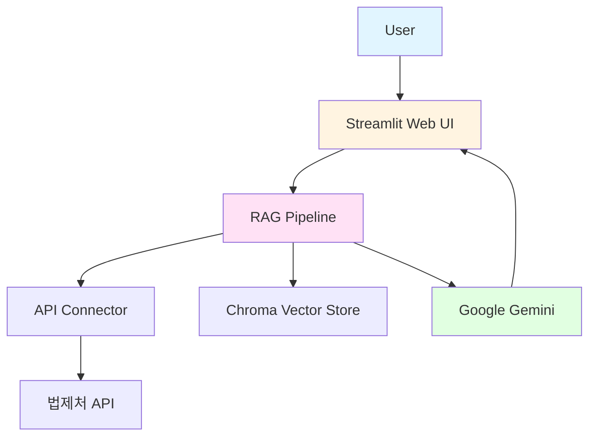
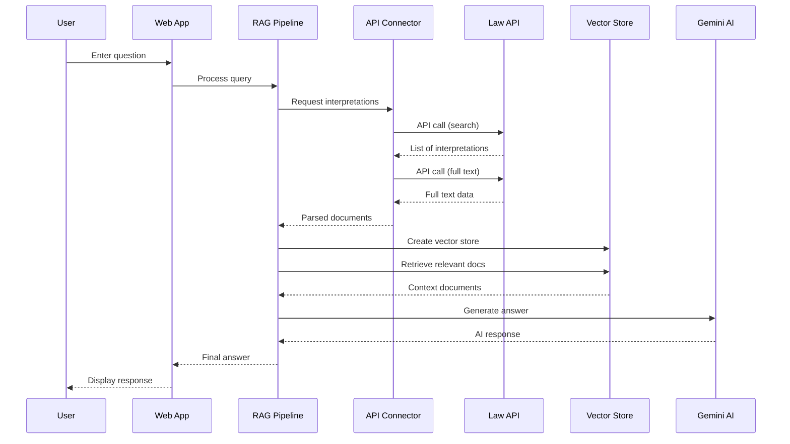

# System Architecture

## Overview

**My Rights Keeper** is a Retrieval-Augmented Generation (RAG) system that provides AI-powered answers to Korean labor law questions using official legal interpretations from the Ministry of Employment and Labor.

## System Components



## Data Flow

### 1. User Query Processing



### 2. Document Processing Pipeline

1. **Query Submission**: User submits a labor law question
2. **API Search**: System searches 법제처 API for relevant interpretations
3. **Document Retrieval**: Full text of top interpretations is fetched
4. **Embedding Generation**: Documents are converted to vector embeddings
5. **Vector Storage**: Embeddings stored in Chroma DB
6. **Semantic Search**: User query is embedded and matched against stored vectors
7. **Context Assembly**: Top-k relevant documents are retrieved
8. **Answer Generation**: Gemini generates answer using retrieved context
9. **Response Delivery**: Formatted answer with sources is displayed

## Module Architecture

### app/config.py
- Centralized configuration management
- Environment variable handling
- API parameter builders
- Validation logic

### app/api_connector.py
- Law API integration
- HTTP request handling with retry logic
- Response parsing
- Error handling and logging

### app/rag_pipeline.py
- Document creation from API data
- Vector store management
- RAG chain implementation
- LLM prompt engineering

### app/web_app.py
- Streamlit UI implementation
- Session state management
- User interaction handling
- Error display

## Technology Stack

### Backend
- **Python 3.9+**: Core language
- **LangChain**: RAG framework
- **Chroma**: Vector database
- **Requests**: HTTP client
- **python-dotenv**: Environment management

### AI/ML
- **Google Gemini 2.5 Flash**: LLM for answer generation
- **Google Embedding-001**: Text embedding model

### Frontend
- **Streamlit**: Web framework

### External APIs
- **법제처 법령해석 API**: Legal interpretation data source

## Configuration

### Environment Variables
```
LAW_API_ID: API key for 법제처
GOOGLE_API_KEY: Google Generative AI API key
LOG_LEVEL: Logging level (DEBUG, INFO, WARNING, ERROR)
```

### Configurable Parameters
- `MAX_RETRIES`: API retry attempts (default: 3)
- `REQUEST_TIMEOUT`: API timeout in seconds (default: 30)
- `DEFAULT_DISPLAY_COUNT`: Results per query (default: 20)
- `GEMINI_MODEL`: LLM model name
- `EMBEDDING_MODEL`: Embedding model name

## Error Handling

### API Errors
- **Timeout**: Exponential backoff retry
- **HTTP Errors**: Logged and returned as None
- **JSON Parse Errors**: Logged and handled gracefully

### RAG Errors
- **No Documents Found**: User-friendly message
- **Vector Store Creation**: Exception raised with logging
- **LLM Generation**: Caught and displayed to user

## Logging

All modules use Python's logging framework:
- **DEBUG**: Detailed diagnostic information
- **INFO**: General informational messages
- **WARNING**: Warning messages for recoverable issues
- **ERROR**: Error messages for failures

Logs include:
- Timestamps
- Module names
- Log levels
- Detailed messages

## Security Considerations

1. **API Keys**: Stored in `.env` file, never committed
2. **Input Validation**: User queries are passed through LangChain
3. **Error Messages**: Sensitive information not exposed to users
4. **Timeout Protection**: Prevents hanging requests

## Performance Considerations

1. **Caching**: Vector store is created per query (ephemeral)
2. **Retry Logic**: Prevents cascading failures
3. **Timeout Settings**: Balances responsiveness and reliability
4. **Batch Processing**: Multiple documents processed efficiently

## Future Enhancements

1. **Persistent Vector Store**: Save embeddings across sessions
2. **Caching Layer**: Cache frequent queries
3. **Async Processing**: Non-blocking API calls
4. **Load Balancing**: Handle multiple concurrent users
5. **Monitoring**: Application performance metrics
